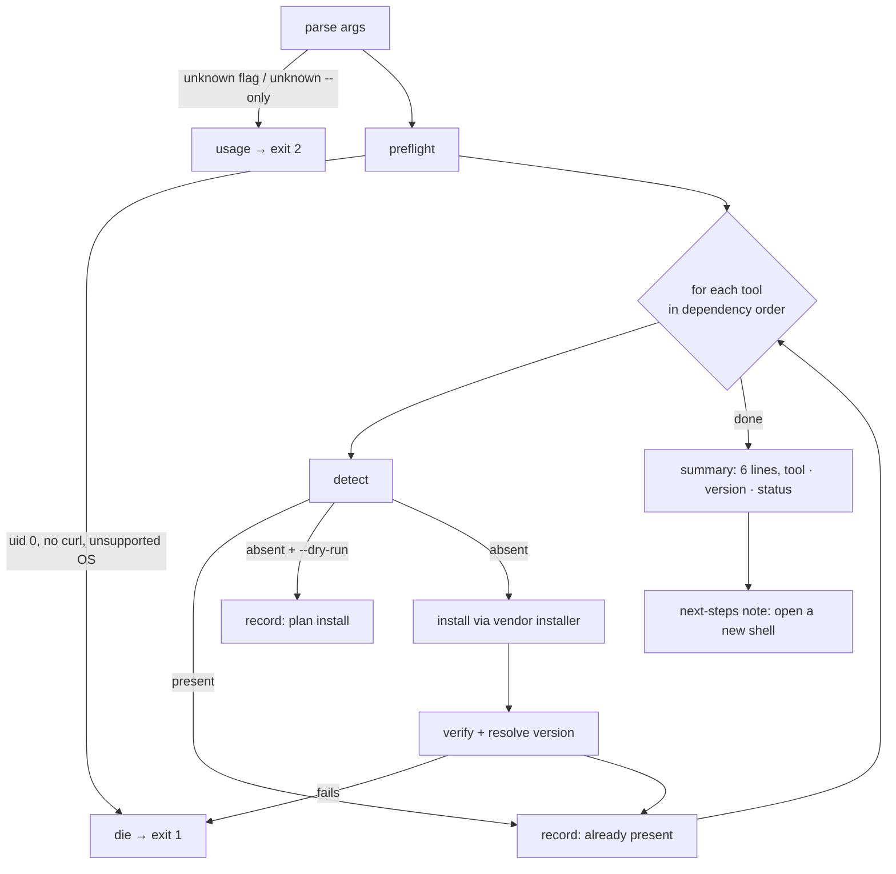
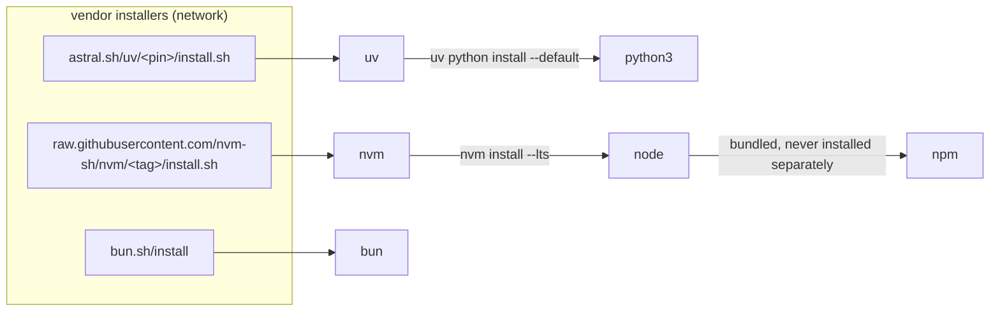
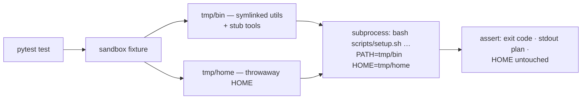

# Design: devbox setup script (`scripts/setup.sh`)

> Phase 2 of 3 (requirements → design → tasks). Derives from the approved
> [`requirements.md`](./requirements.md) (locked 2026-07-29 by @MadaraUchiha-314).
> MUST be reviewed and approved before moving to tasks breakdown.

## Overview

One `bash` script, no runtime dependencies beyond `curl` and a handful of POSIX
utilities, structured as a **registry of six tools × three operations**
(`detect` → `install` → `version`). The main loop walks the registry in dependency order,
asks each tool whether it is already present, and either skips it or installs it via the
vendor's own installer — downloaded to a private temp directory and executed from disk,
never piped straight into a shell.

That single structural choice is what buys most of the requirements at once:
`--dry-run` (R3.1) is the same loop with the install step replaced by a print;
idempotency (R2) is the `detect` step returning true; the end-of-run summary (R1.2) is the
`version` step run over every tool regardless of what happened to it.



## Architecture

### The tool graph (why six names are four installers)



Execution order is a topological sort of that graph:
`uv → python3 → nvm → node → npm → bun`. `npm` has no installer at all — its `install`
operation is a no-op that asserts Node brought it along, which is why R1.4 ("name the
failing tool") matters: a Node distribution without `npm` must be reported, not assumed.

### Script layout

| Section        | Responsibility                                                                   |
|----------------|----------------------------------------------------------------------------------|
| Header         | `#!/usr/bin/env bash`, `set -euo pipefail`, doc comment                          |
| **Pins**       | One block of `readonly` version/URL constants — the only place to bump a version |
| Output helpers | `log`, `warn`, `die`, `record` — one message format everywhere (R4.1)            |
| Preflight      | root refusal, `curl` presence, OS/arch support, temp dir + `trap` cleanup        |
| Fetch helper   | `fetch_and_run` — the single chokepoint every network install goes through       |
| Tool registry  | `detect_<tool>` / `install_<tool>` / `version_<tool>` for each of the six        |
| Driver         | arg parsing, dependency-ordered loop, summary, exit code                         |

**bash 3.2 constraint (NFR).** macOS ships `/bin/bash` 3.2, so the script uses no
associative arrays, no `mapfile`, no `${var,,}`. The registry is therefore a
space-separated `TOOLS` string plus naming-convention dispatch
(`"detect_${tool}"`), not a hash map — the idiom that works on both bash 3.2 and 5.x.

### Pins, and what is honestly pinnable

| Tool    | Pinned?         | Mechanism                                                                                                |
|---------|-----------------|----------------------------------------------------------------------------------------------------------|
| nvm     | yes (installer) | Tag-versioned raw URL — `master` would be strictly more dangerous                                        |
| uv      | yes (installer) | Astral publishes version-scoped installer URLs (`astral.sh/uv/<version>/install.sh`)                     |
| bun     | tool only       | `bun.sh/install` is not itself versioned; the bun *version* is pinned via the installer's positional arg |
| node    | no (by design)  | `nvm install --lts` — approved assumption 2 in requirements                                              |
| python3 | minor only      | `uv python install --default <minor>` — patch floats, minor is pinned                                    |

The concrete pin values are resolved **once, at implementation time**, from each vendor's
published latest release, and then live as literals in the Pins block with a comment on
how to bump them. They are recorded in the execution log so the provenance of each pin is
auditable rather than folklore.

## Components & interfaces

### CLI contract

```text
Usage: scripts/setup.sh [--dry-run] [--only <tool>] [--help]

  --dry-run        Print the planned action for every tool; change nothing.
  --only <tool>    Act on one tool only. One of: nvm node npm bun python3 uv
  --help           Print this usage and exit.

Exit codes: 0 success · 1 runtime failure · 2 usage error
```

### `fetch_and_run <url> [args...]` — the security chokepoint

Every byte of third-party code the script executes passes through this one function, so
the hardening lives in exactly one place and a test can assert there is no second path:

```bash
curl --fail --location --proto '=https' --tlsv1.2 \
     --silent --show-error "$url" -o "$WORKDIR/installer.sh"
"${BASH}" "$WORKDIR/installer.sh" "$@"
```

- `--fail` — a 4xx/5xx becomes a non-zero exit instead of an HTML error page executed as
  a shell script.
- `--proto '=https'` — redirects may not downgrade off HTTPS.
- `-o <file>` then run `<file>` — **download completes before anything runs**, so a
  truncated stream cannot execute a half payload (abuse case 3).
- `"${BASH}"` — the interpreter *already running this script*, not a `PATH` lookup of
  `bash`. **Implementation delta** (2026-07-29, task 4): the design originally said
  `bash <file>`; a test that ran the script with no `bash` on `PATH` exposed that as a
  lookup against one of the untrusted inputs named in the threat model. Locked in by
  `test_installer_runs_under_the_current_interpreter`.

### Tool operations

| Tool      | `detect`                                                                  | `install`                                                         | `version`                      |
|-----------|---------------------------------------------------------------------------|-------------------------------------------------------------------|--------------------------------|
| `uv`      | `command -v uv`                                                           | `fetch_and_run` uv installer                                      | `uv --version`                 |
| `python3` | `command -v python3` **and** minor ≥ 3.11                                 | `uv python install --default <pin>`                               | `python3 -V`                   |
| `nvm`     | `[ -s "$NVM_DIR/nvm.sh" ]` — nvm is a **shell function**, never on `PATH` | `fetch_and_run` nvm installer                                     | `nvm --version` after sourcing |
| `node`    | `command -v node`                                                         | source `nvm.sh`; `nvm install --lts`; `nvm alias default 'lts/*'` | `node -v`                      |
| `npm`     | `command -v npm`                                                          | *(none — bundled with node)*                                      | `npm -v`                       |
| `bun`     | `command -v bun`                                                          | `fetch_and_run` bun installer, pinned version arg                 | `bun --version`                |

**Why `python3` detection carries a version predicate.** macOS ships an Xcode
`/usr/bin/python3` shim; a bare `command -v python3` would call the machine provisioned
when it is not. The `≥ 3.11` floor matches this repo's own `pyproject.toml`
`requires-python`, so "python3 present" means "present *and* usable here".

### PATH handling — the script's, never the operator's

A freshly installed tool is not on the `PATH` of the already-running script. After each
install the script prepends the vendor's bin directory **to its own `PATH`** so
verification (R1.4) can actually run:

```text
$HOME/.local/bin   (uv, and uv's python3 shims)
$HOME/.bun/bin     (bun)
$NVM_DIR           (sourced, not PATH-ed)
```

It does **not** edit `~/.zshrc` / `~/.bashrc` (R2.3) — the vendor installers already
append their own lines, and a second writer is how rc files rot. The final "next steps"
note tells the operator to open a new shell (R4.3).

## UI/UX design

N/A — this is a CLI/infra work item with no user-facing surface. The only "UI" is the
script's terminal output, whose format is specified by R1.2/R4.1 and asserted by the
tests below.

## Data models

No persistence. The only in-memory state is the run summary, accumulated as a
newline-separated string of `<tool>\t<version>\t<status>` records (bash 3.2 — a string,
not an array of maps) and printed once at the end. `status` is a closed set:
`installed` · `already present` · `planned` (dry-run only) · `failed`.

## Error handling

| Failure                                  | Detection                                       | Response                                      |
|------------------------------------------|-------------------------------------------------|-----------------------------------------------|
| Unknown flag / unknown `--only`          | Arg parse against a fixed allow-list            | Usage → stderr, **exit 2**, nothing installed |
| Running as root                          | `[ "$(id -u)" -eq 0 ]`                          | `die` → exit 1, before any network access     |
| `curl` absent                            | `command -v curl` in preflight                  | `die` naming curl → exit 1                    |
| Unsupported OS/arch                      | `uname -s` / `uname -m` against a supported set | `die` naming the platform → exit 1            |
| Download failure / non-2xx / TLS failure | `curl --fail --proto '=https'` non-zero         | `set -e` aborts; installer never executed     |
| Vendor installer fails                   | Non-zero exit, output **passed through** (R4.2) | Abort at that tool; later tools not attempted |
| Post-install verification fails          | `detect` still false after `install`            | `die` naming the tool → exit 1 (R1.4)         |
| Interrupt / any exit                     | `trap … EXIT`                                   | Temp dir removed                              |

`set -euo pipefail` is the backstop: an unset variable or an unchecked failure aborts the
run rather than continuing into a half-provisioned state. Observability is the same at
dev-time and runtime (`observability` config): the step log *is* the debug channel, with
`--dry-run` as the no-side-effect view.

## Security design

Each trust boundary from the requirements' threat model, and the mechanism that enforces
it. Mechanisms, not intentions.

### Boundary 1 — network → local execution

| Control                    | Implementation                                                                                                        | Proven by                                       |
|----------------------------|-----------------------------------------------------------------------------------------------------------------------|-------------------------------------------------|
| HTTPS only                 | `--proto '=https'` (redirects included), all URLs literal `https://`                                                  | `test_all_urls_are_https_and_vendor_hosted`     |
| Official vendor hosts only | URL constants in the Pins block; host allow-list `raw.githubusercontent.com` (nvm-sh/nvm path), `bun.sh`, `astral.sh` | same test, asserted over the script **source**  |
| Pinned versions            | Tag/version-scoped URLs; bun version as installer arg                                                                 | `test_installer_urls_are_version_pinned`        |
| No partial execution       | Download to `$WORKDIR` **then** `bash <file>`                                                                         | `test_failed_download_aborts_without_executing` |
| Single chokepoint          | Exactly one `curl` invocation in the script                                                                           | asserted by source test (no second fetch path)  |

### Boundary 2 — arguments → control flow

`--only` is matched against the fixed `TOOLS` allow-list *before* it is used, and is never
interpolated into a URL or a command string; dispatch is `"install_${tool}"` on an
already-validated name. Abuse case 4 (`--only "; rm -rf ~"`) is a negative test.

### Boundary 3 — environment → filesystem writes

- **No `sudo`, no root.** uid 0 is refused in preflight (abuse case 1), and the string
  `sudo` does not appear in the script — asserted by `test_script_never_uses_sudo`.
- **Writes stay under `$HOME`:** `$NVM_DIR` (default `$HOME/.nvm`), `~/.bun`,
  `~/.local`. No system paths, no `/usr/local` writes of our own.
- **Temp files:** `WORKDIR="$(mktemp -d)"` — a fresh 0700 directory owned by the user, so
  a pre-planted symlink in shared `/tmp` cannot be followed (abuse case 5) — with
  `trap 'rm -rf "$WORKDIR"' EXIT` for cleanup.
- **Least privilege:** the script needs only the operator's own user rights; it opens no
  ports, reads no credentials, and sends nothing outbound beyond the three GETs.

### Secrets

None. The script reads no credential file, accepts no token, and prints no environment.
Nothing it writes is sensitive.

### Fail-closed summary

Unknown flag · unknown `--only` · uid 0 · missing `curl` · unsupported platform · failed
download · failed verification → **abort, non-zero, no further installation**. There is no
"continue anyway" path.

### Abuse-case coverage

| #   | Abuse case                                   | Mechanism                       | Negative test                                   |
|-----|----------------------------------------------|---------------------------------|-------------------------------------------------|
| 1   | Run as root                                  | uid-0 refusal in preflight      | `test_refuses_to_run_as_root`                   |
| 2   | Non-HTTPS / third-party URL introduced later | Source-level assertion          | `test_all_urls_are_https_and_vendor_hosted`     |
| 3   | Truncated / failed download                  | `--fail`, download-then-execute | `test_failed_download_aborts_without_executing` |
| 4   | `--only` injection                           | Allow-list validation           | `test_rejects_injection_in_only_flag`           |
| 5   | Temp-file symlink attack                     | `mktemp -d` + `trap` cleanup    | `test_uses_private_tempdir`                     |

## Testing strategy

**The testing problem:** the script's purpose is to mutate the machine it runs on, so the
tests must exercise it *without* installing anything. The solution is a **PATH sandbox**:
each test builds a temp `bin/` containing symlinks to an explicit allow-list of real
utilities the script needs (`curl`, `id`, `mktemp`, `rm`, `uname`) plus stub scripts for
whichever tools that scenario wants to look "installed" — then runs the script with
`PATH` set to that directory alone and `HOME` pointed at a temp dir.



Nothing reaches the network: dry-run scenarios never fetch, and the one failure-path test
stubs `curl` itself. Every test is offline, hermetic and fast.

Tests are **pytest integration tests** under `tests/integration/`, each carrying a Gherkin
docstring with a `Requirement:` link (`testing.gherkinDocstrings: required`), queryable via
`the-loop scenarios`.

| Scenario                                           | Proves                |
|----------------------------------------------------|-----------------------|
| `Script parses as valid bash` (`bash -n`)          | NFR (bash 3.2 target) |
| `Help lists every tool and flag`                   | R3.2                  |
| `Unknown flag fails closed`                        | R3.4                  |
| `Unknown --only value fails closed`                | R3.4                  |
| `Injection in --only is rejected`                  | Abuse case 4          |
| `Dry run on a bare machine plans every install`    | R3.1, R1.1            |
| `Dry run changes nothing on disk`                  | R3.1, R2.3            |
| `Dry run with everything present plans only skips` | R2.1, R2.2            |
| `--only acts on a single tool`                     | R3.3                  |
| `Refuses to run as root`                           | Abuse case 1          |
| `Failed download aborts without executing`         | Abuse case 3, R1.4    |
| `Missing curl fails closed`                        | R1.4                  |
| `Every URL is HTTPS on a vendor host`              | Abuse case 2          |
| `Installer URLs are version pinned`                | Security design       |
| `Script never uses sudo`                           | Boundary 3            |
| `Uses a private temp directory`                    | Abuse case 5          |

**Acceptance evidence** (R1.1/R1.2, which no sandbox can prove): one real run of
`scripts/setup.sh` on this machine, with its output captured into the execution log — the
only way to demonstrate the script actually provisions a box. Because this devbox already
has all six tools, that run doubles as the **idempotency proof** (R2.2): every line must
read `already present`.

## Trade-offs & decisions

1. **bash, not Python.** The script must run *before* `python3`/`uv` exist — bootstrapping
   in a language the script installs is circular. `bash` is the only interpreter
   guaranteed present on a bare macOS box. (Minimalism ladder: stdlib/native over a new
   dependency.)
2. **Download-then-execute over `curl | bash`.** One extra file and a temp dir, in
   exchange for eliminating partial-payload execution. Cheap, so it is not a trade-off so
   much as a correction of a bad default the whole ecosystem ships.
3. **Vendor installers over Homebrew.** Homebrew would be a fifth dependency, is
   macOS-centric, and lags upstream for exactly these fast-moving tools. Cost: three
   different installer conventions to accommodate.
4. **uv as the `python3` fallback, not the `python3` owner.** An existing system `python3`
   ≥ 3.11 wins; uv only fills a gap. This keeps the script from quietly shadowing an
   interpreter the operator chose deliberately. (Approved assumption 1.)
5. **A dry-run plan, not a `--verbose` flag.** `--dry-run` is required by R3.1 *and* is
   the seam that makes the whole script testable offline. One mechanism, two jobs.
6. **No `--force` / `--upgrade` / uninstall.** Out of scope per requirements; `nvm
   install`, `uv self update` and `bun upgrade` already own those flows. (YAGNI.)
7. **New dependencies: none.** No new Python packages, no new binaries beyond what the
   issue asks the script to install. `curl` is present on macOS and every mainstream
   Linux.

Nothing here rises to a durable architecture decision worth its own `docs/decisions/`
record — the choices are local to one script. Assumptions taken mid-flight are logged in
[`docs/decisions/conflicts.md`](../../decisions/conflicts.md).

## Capability docs (fold-in)

This work item mints a new capability doc — `docs/capabilities/devbox-provisioning.md`
(what a provisioned devbox contains and how it gets that way) — plus an index row in
`docs/capabilities/capabilities.md`, updated **in the same PR** as the implementation.

## Open questions

None blocking. The pin values (nvm tag, uv version, bun version, python minor) are
resolved from vendor releases during implementation and recorded in the execution log;
they are data, not design.

## Review comments

> Appended by the-loop's `record-feedback` hook when a human gate approves with
> comments (issue-109).
