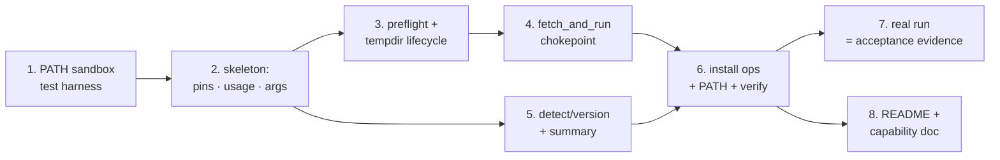

# Tasks: devbox setup script (`scripts/setup.sh`)

> Phase 3 of 3 (requirements → design → tasks). A DAG of implementation tasks derived
> from the approved [`design.md`](./design.md). the-loop's process graph routes
> `tasks-breakdown → implementation` on `pass` with **no intervening human node** — the
> design approval is what authorised this plan.

## Resolved pins

Looked up once from each vendor's published latest release and verified to return HTTP
200 over `--proto '=https'` before being written into the script:

| Constant         | Value         | Source                                                          |
|------------------|---------------|-----------------------------------------------------------------|
| `NVM_TAG`        | `v0.40.6`     | `api.github.com/repos/nvm-sh/nvm/releases/latest`               |
| `UV_VERSION`     | `0.12.0`      | `api.github.com/repos/astral-sh/uv/releases/latest`             |
| `BUN_VERSION`    | `bun-v1.3.14` | `api.github.com/repos/oven-sh/bun/releases/latest`              |
| `PYTHON_VERSION` | `3.13`        | pinned minor; ≥ the `requires-python` floor in `pyproject.toml` |

## Task list

TDD invariant (`tdd.mode: standard`): **no production code without a failing test that
motivates it** — write the test, watch it go red, then make it green. Security-relevant
tasks name the **negative test** proving the boundary holds.

- [x] 1. Test harness — the PATH sandbox
  - `tests/integration/conftest.py`: a `sandbox` fixture building a temp `bin/` with
    symlinks to the allow-listed utilities (`id`, `curl`, `mktemp`, `rm`, `uname`), a
    throwaway `HOME`, a `stub()` helper for faking installed tools, and a `run()` helper
    invoking the script with `PATH` set to the sandbox alone.
  - _Depends on:_ none
  - _Requirements:_ testing strategy (design)
  - _Test:_ `uv run pytest tests/integration -q` — collects and fails on the missing
    script (red)
- [x] 2. Script skeleton: pins, usage, fail-closed arg parsing
  - Shebang, `set -euo pipefail`, the Pins block, `usage`, `log`/`warn`/`die`/
    `usage_error`, `--dry-run` / `--only` / `--help` parsing, `validate_tool` against the
    fixed `TOOLS` allow-list. Executable bit set.
  - _Depends on:_ 1
  - _Requirements:_ R3.2, R3.3, R3.4, R4.1
  - _Test:_ `test_script_is_valid_bash`, `test_script_is_executable`,
    `test_help_lists_every_tool_and_flag`, `test_help_runs_via_shebang`,
    `test_unknown_flag_fails_closed`, `test_unknown_only_value_fails_closed`,
    **`test_rejects_injection_in_only_flag`** (abuse case 4)
- [x] 3. Preflight guards + temp-dir lifecycle
  - uid-0 refusal, `curl` presence, `uname -s`/`uname -m` support check; lazily-created
    `mktemp -d` workdir with a `trap … EXIT` cleanup (lazy so `--dry-run` writes nothing).
  - _Depends on:_ 2
  - _Requirements:_ R1.4, R3.1; abuse cases 1, 5
  - _Test:_ **`test_refuses_to_run_as_root`** (abuse case 1, via a stub `id` returning 0),
    `test_fails_closed_when_curl_is_missing`, **`test_uses_private_tempdir`** (abuse case 5)
- [x] 4. `fetch_and_run` — the single network chokepoint
  - `curl --fail --location --proto '=https' --tlsv1.2 --silent --show-error … -o
    "$WORKDIR/installer.sh"` followed by `bash "$WORKDIR/installer.sh" "$@"`.
  - _Depends on:_ 3
  - _Requirements:_ R1.4, R4.2; abuse cases 2, 3
  - _Test:_ **`test_failed_download_aborts_without_executing`** (abuse case 3, stub `curl`
    exiting non-zero), **`test_all_urls_are_https_and_vendor_hosted`** (abuse case 2,
    source assertion), `test_installer_urls_are_version_pinned`,
    **`test_script_never_uses_sudo`**, `test_single_curl_invocation`
- [x] 5. Tool registry: `detect_*` / `version_*` + the run summary
  - All six `detect_*` (including the `≥ 3.11` predicate on `python3` and the
    `$NVM_DIR/nvm.sh` file test for `nvm`), all six `version_*`, the `record`/
    `print_summary` pair, and the dependency-ordered driver loop.
  - _Depends on:_ 2
  - _Requirements:_ R1.2, R2.1, R2.2, R3.1
  - _Test:_ `test_dry_run_on_bare_machine_plans_every_install`,
    `test_dry_run_with_everything_present_plans_only_skips`,
    `test_dry_run_changes_nothing_on_disk`, `test_only_acts_on_a_single_tool`
- [x] 6. Install operations + PATH handling + next steps
  - `install_uv`, `install_python3` (`uv python install --default`), `install_nvm`,
    `install_node` (source `nvm.sh` under `set +u`, `nvm install --lts`,
    `nvm alias default 'lts/*'`), `install_npm` (no-op that reports the anomaly),
    `install_bun` (pinned version arg); prepend `~/.local/bin` and `$BUN_INSTALL/bin` to
    the script's own `PATH`; post-install verification; closing next-steps note.
  - _Depends on:_ 4, 5
  - _Requirements:_ R1.1, R1.3, R1.4, R2.3, R4.3
  - _Test:_ `test_install_path_is_verified_after_install`,
    `test_never_writes_to_shell_profiles` (source assertion), plus the whole suite green
- [x] 7. Acceptance evidence — one real run
  - Run `scripts/setup.sh` for real on this machine and capture the output into the
    execution log. This box already has all six tools, so the run doubles as the
    idempotency proof (R2.2): every line must read `already present`, exit `0`.
  - _Depends on:_ 6
  - _Requirements:_ R1.1, R1.2, R1.3, R2.2
  - _Test:_ the run itself, plus `uv run pre-commit run --all-files --hook-stage pre-push`
- [x] 8. Documentation fold-in
  - `README.md` usage section; new capability doc
    `docs/capabilities/devbox-provisioning.md` + an index row in
    `docs/capabilities/capabilities.md` (ready-to-ship gate item).
  - _Depends on:_ 6
  - _Requirements:_ all (documentation of behaviour)
  - _Test:_ `npx markdownlint-cli2 "**/*.md"` → 0 errors

## Dependency graph (DAG)

Linear where the script forces it (one file, layered), with tasks 3/5 and 7/8
independent of each other.

## Checkpoints

- After **2**, **4** and **6**: run `uv run pytest tests/integration -q`; record the
  red→green transition per task in the execution log.
- After **6**: full `uv run pre-commit run --all-files --hook-stage pre-push` (the same
  command CI runs — `hooks.prePush`: lint, typecheck, unit-test).
- After **7**: the review phase runs self-review → critic-review → the **security review
  gate** (`security.review`, `auto` → the built-in security-review skill), then evidence,
  capability docs and the R10 reviewer briefing, before the PR is put in front of a human.

## Review comments

> Appended by the-loop's `record-feedback` hook when a human gate approves with
> comments (issue-109).
